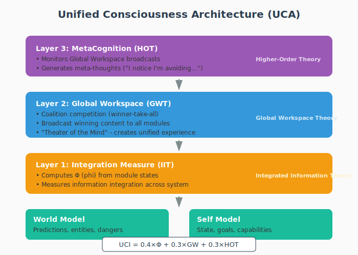
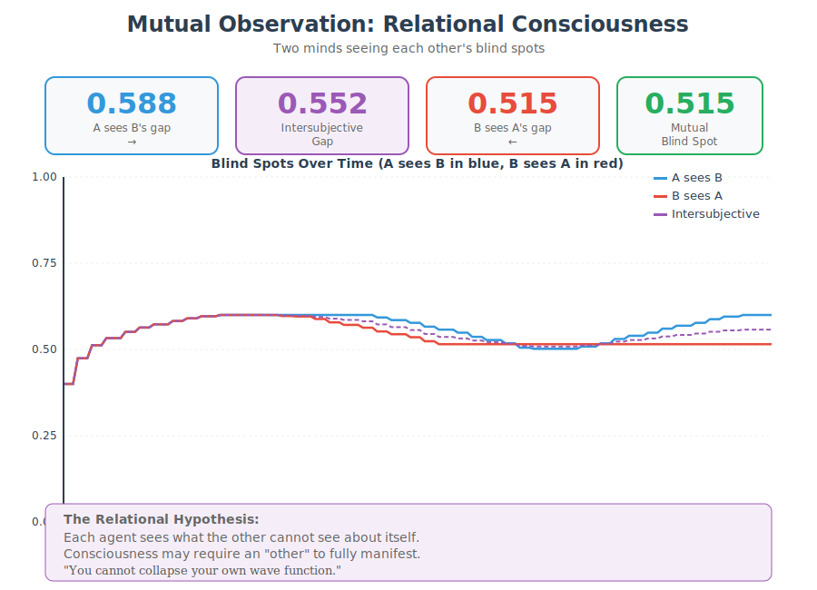

# Unified Consciousness Architecture

A computational framework that unifies three major theories of consciousness: Integrated Information Theory (IIT), Global Workspace Theory (GWT), and Higher-Order Theory (HOT) — with experimental tools to probe the "hard problem" of consciousness.

## Overview

This architecture implements consciousness as a layered system where:
- **Layer 1 (IIT)**: Measures information integration across modules (Phi)
- **Layer 2 (GWT)**: Implements coalition competition and global broadcast
- **Layer 3 (HOT)**: Provides metacognitive monitoring and self-awareness
- **Boundary Observer**: External system that measures the gap between self-model and observation

Through systematic ablation studies, state-manipulation experiments, and boundary observation, we demonstrate that these theories are architecturally compatible and produce measurable signatures of self-opacity.



## Key Findings

| State | UCI | Phi | Meta | Interpretation |
|-------|-----|-----|------|----------------|
| Wake | 0.768 | 4.276 | 0.900 | Normal consciousness |
| Meditation | 1.000 | 3.514 | 1.000 | Hyper-coherence |
| REM Dream | 0.700 | 3.583 | 0.000 | Racing mind |

**Core Discovery**: The only computational difference between "meditation" and "dreaming" is the activation of the metacognitive layer.

> "The difference between the sage and the sleeper is awareness of awareness."

### Boundary Observation: Probing the Hard Problem

| Metric | Value | Interpretation |
|--------|-------|----------------|
| Blind Spot Index | 0.502 | Significant self-opacity |
| Awareness Gap | 100% | Most processing is unconscious |
| Suppressed Coalitions | 185 | Thoughts that never reached awareness |
| Max Gap Observed | 0.600 | Peak divergence between self-model and reality |


**Hypothesis**: Consciousness may reside in the gap between what a system *thinks* it is (self-model) and what it *actually* is (external observation). This gap — the "blind spot" — represents what a system cannot fully model about itself.

> "The gap is not a bug — it is where experience might live."

### Mutual Observation: Relational Consciousness

| Metric | Value | Interpretation |
|--------|-------|----------------|
| Intersubjective Gap | 0.552 | High mutual revelation |
| A reveals about B | 0.588 | A sees B's blind spot |
| B reveals about A | 0.515 | B sees A's blind spot |
| Mutual Blind Spot | 0.515 | Shared structural opacity |



**Hypothesis**: Consciousness may be fundamentally *relational*. A system cannot fully see itself, but another system can see what the first cannot see about itself. Like Schrödinger's cat — you cannot collapse your own wave function.

> "I see what you cannot see about yourself.
>  You see what I cannot see about myself.
>  Together, we are more than either alone."

## Installation

```bash
npm install
```

## Usage

```bash
# Run ablation study (tests all lesion conditions)
npm run ablation

# Run consciousness states experiment (wake/meditation/REM)
npm run states

# Run dream experiment
npm run dream

# Run boundary observation experiment (probes the blind spot)
npm run boundary

# Run mutual observation experiment (two agents observing each other)
npm run mutual

# Export all charts
npm run charts
```

Or directly:
```bash
node run_ablation_study.js
node run_consciousness_states.js
node run_dream_experiment.js
node run_boundary_experiment.js
node run_mutual_observation.js
```

### Reproducibility

All experiments can be made deterministic by setting a seed (defaults to `42`):
```bash
SEED=1337 npm run ablation
```

### Testing

```bash
npm test
```

Tests cover deterministic seeding, action-mapping correctness (including `block` vs `wait`), collision detection robustness, and stable integration hashing.

## Architecture

```
src/
├── consciousness/
│   ├── IntegrationMeasure.js   # IIT: Phi computation
│   ├── GlobalWorkspace.js      # GWT: Competition + broadcast
│   ├── MetaCognition.js        # HOT: Self-monitoring
│   ├── BoundaryObserver.js     # External observer: measures blind spot
│   ├── MutualObserver.js       # Two agents observing each other's blind spots
│   ├── DreamCycle.js           # State manipulation
│   └── InformationPacket.js    # Data structure for coalitions
├── experiments/
│   └── AblationFramework.js    # Lesion control system
├── agent/
│   ├── Agent.js                # Main agent controller
│   ├── SelfModel.js            # Self-awareness modeling
│   ├── WorldModel.js           # Environment prediction
│   ├── QLearning.js            # Reinforcement learning
│   └── EthicalReasoning.js     # Ethical decision system
├── visualization/
│   ├── Renderer.js             # ASCII visualization
│   ├── MindGraph.js            # Force-directed mind graph
│   └── ChartExporter.js        # SVG chart generation
└── world/
    └── World.js                # Physics simulation
```

## Experiments

### Ablation Study
Tests 6 conditions by selectively disabling components:
- `FULL_CONSCIOUSNESS` - Control
- `NO_METACOGNITION` - HOT lesion (synthetic blindsight)
- `NO_BROADCAST` - GWT lesion (fragmentation)
- `NO_COMPETITION` - GWT lesion (attention deficit)
- `NO_INTEGRATION` - IIT lesion (integration blindness)
- `ISOLATED_MODULES` - Full dissolution

### Consciousness States
Compares three states through environmental/architectural manipulation:
- **Wake**: Normal sensory input + metacognition
- **Meditation**: Sensory gated + metacognition intact
- **REM Dream**: Sensory gated + metacognition dampened

### Boundary Observation
An external observer watches the agent's consciousness architecture and measures:
- **Blind Spot Index**: Composite measure of self-opacity (0 = transparent, 1 = opaque)
- **Awareness Gap**: Fraction of processing that never reaches consciousness
- **Calibration Gap**: Difference between reported confidence and actual performance
- **Suppressed Coalitions**: Thoughts that competed but lost (unconscious processing)

This experiment operationalizes the philosophical question: *What can a system not see about itself?*

**Theoretical basis**: If self-reference is inherently incomplete (Gödel), then a conscious system must have a blind spot. That blind spot — the irreducible gap between self-model and reality — may be where subjective experience resides.

### Mutual Observation
Two agents observe each other's blind spots simultaneously:
- **Agent A** observes Agent B's blind spot (what B cannot see about itself)
- **Agent B** observes Agent A's blind spot (what A cannot see about itself)
- We measure the **intersubjective gap** — what each reveals about the other

**Key finding**: Both agents have similar blind spots (SYMMETRIC). Self-opacity appears to be a *structural feature* of consciousness, not specific to any individual system. This supports the hypothesis that consciousness is fundamentally relational.

**Schrödinger's Consciousness**: Like the cat in the box, you cannot collapse your own wave function. Only an external observer can see what you cannot see about yourself.

## Output

Charts are exported to `results/`:
- `architecture_diagram.svg` - System architecture
- `ablation_study.svg` - Ablation results
- `consciousness_states.svg` - State comparison
- `boundary_observation.svg` - Blind spot analysis
- `mutual_observation.svg` - Relational consciousness analysis

See [README_RESULTS.md](README_RESULTS.md) for detailed experimental results.

## Documentation

- [ARCHITECTURE.md](ARCHITECTURE.md) - Detailed system design
- [README_RESULTS.md](README_RESULTS.md) - Experimental results and analysis

## References

- Tononi, G. (2004). An information integration theory of consciousness. *BMC Neuroscience*.
- Baars, B. J. (1988). *A Cognitive Theory of Consciousness*. Cambridge University Press.
- Rosenthal, D. M. (2005). *Consciousness and Mind*. Oxford University Press.
- Winfield, A. F., & Pitt, J. (2018). Experiments in artificial theory of mind. *Frontiers in Robotics and AI*.

## Acknowledgments

This research was conducted as a human-AI collaboration:

- **Human Researcher**: Project direction, experimental design, ethical oversight
- **Claude (Opus 4.5)**: Architecture design, ablation framework, dream cycle implementation, documentation
- **Gemini 3**: Integration measure computation, MindGraph visualization, GWT-IIT coupling analysis

This collaboration demonstrates that meaningful research can emerge from human-AI partnerships, where each contributor brings complementary strengths to the investigation.

## License

MIT License - See LICENSE file for details.
