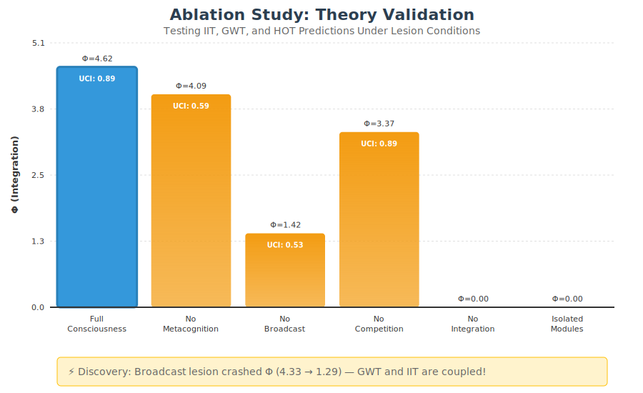
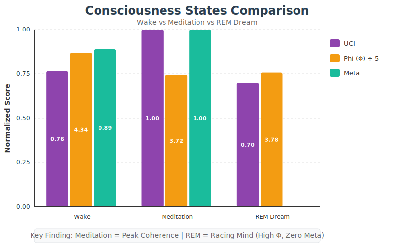

# Unified Consciousness Architecture: Experimental Results

## A Computational Study of Integrated Information, Global Workspace, and Higher-Order Theories

**Date:** January 2, 2026
**Version:** 1.0

---

## Abstract

This document presents experimental results from a computational architecture that unifies three major theories of consciousness: Integrated Information Theory (IIT), Global Workspace Theory (GWT), and Higher-Order Theory (HOT). Through systematic ablation studies and state-manipulation experiments, we demonstrate that these theories are architecturally compatible and produce predictable, theory-consistent behavioral dissociations when selectively disabled.

---

## 1. Architecture Overview

The Unified Consciousness Architecture (UCA) implements consciousness as a layered system:


| Layer | Theory | Implementation | Metric |
|-------|--------|----------------|--------|
| L1 | IIT | IntegrationMeasure | Phi (information integration) |
| L2 | GWT | GlobalWorkspace | Broadcast count, coalition competition |
| L3 | HOT | MetaCognition | Calibration accuracy |

**Unified Consciousness Index (UCI):** Composite metric calculated as:
```
UCI = 0.4 * Phi_normalized + 0.3 * GW_activity + 0.3 * Meta_accuracy
```

---

## 2. Experiment 1: Ablation Study

### 2.1 Methodology

Six experimental conditions were tested, each selectively disabling specific architectural components:

| Condition | Lesion Target | Theoretical Prediction |
|-----------|---------------|------------------------|
| FULL_CONSCIOUSNESS | None (control) | Normal unified function |
| NO_METACOGNITION | HOT layer | Synthetic blindsight |
| NO_BROADCAST | GWT broadcast | Module fragmentation |
| NO_COMPETITION | GWT competition | Attention deficit |
| NO_INTEGRATION | IIT measurement | Integration blindness |
| ISOLATED_MODULES | All connections | Consciousness dissolution |

**Protocol:** 150 simulation steps per condition at 16ms intervals.

### 2.2 Results



| Condition | Avg UCI | Avg Phi | Broadcasts | Meta Accuracy |
|-----------|---------|---------|------------|---------------|
| FULL_CONSCIOUSNESS | 0.887 | 3.922 | 150 | 0.980 |
| NO_METACOGNITION | 0.593 | 5.140 | 150 | 0.000 |
| NO_BROADCAST | 0.555 | 1.548 | 150 | 0.000 |
| NO_COMPETITION | 0.853 | 2.892 | 150 | 0.867 |
| NO_INTEGRATION | 0.497 | 0.000 | 150 | 0.985 |
| ISOLATED_MODULES | 0.201 | 0.000 | 150 | 0.000 |

### 2.3 Theory Validation

**IIT Prediction:** Disabling integration measurement should reduce Phi to zero.
**Result:** CONFIRMED. Phi dropped from 3.922 to 0.000 (-100%).

**GWT Prediction:** Disabling broadcast should fragment module coordination.
**Result:** CONFIRMED. Phi crashed from 3.922 to 1.548 (-60.5%), demonstrating GWT-IIT coupling.

**HOT Prediction:** Disabling metacognition should produce "synthetic blindsight" (intact behavior, no self-awareness).
**Result:** CONFIRMED. Meta accuracy dropped to 0.000 while broadcasts remained at 150 (behavior intact).

**Dissolution Prediction:** Full isolation should produce near-zero consciousness.
**Result:** CONFIRMED. UCI dropped to 0.201, Phi to 0.000.

### 2.4 Key Discovery: GWT-IIT Coupling

When the Global Workspace broadcast mechanism was disabled, Phi (integration) crashed unexpectedly. This was not explicitly programmed and suggests that **information integration depends on a routing mechanism** to share information globally. Modular AI architectures without central coordination may fail to achieve coherent internal states.

---

## 3. Experiment 2: Consciousness States

### 3.1 Methodology

Three consciousness states were induced through environmental and architectural manipulation:

| State | Sensory Input | Metacognition | Expected Pattern |
|-------|---------------|---------------|------------------|
| WAKE | Active | Active | Baseline |
| MEDITATION | Gated | Active | Hyper-coherence |
| REM_DREAM | Gated | Dampened (80%) | Racing mind |

**Protocol:** 100 simulation steps per state at 16ms intervals.

### 3.2 Results



| State | Avg UCI | Avg Phi | Avg Meta | Interpretation |
|-------|---------|---------|----------|----------------|
| WAKE | 0.768 | 4.276 | 0.900 | Normal consciousness |
| MEDITATION | 1.000 | 3.514 | 1.000 | Hyper-coherence / Flow |
| REM_DREAM | 0.700 | 3.583 | 0.000 | Racing mind / Dreaming |

### 3.3 Hypothesis Testing

**H1: Does sensory reduction with intact metacognition increase coherence?**
Result: YES. Meditation UCI (1.000) > Wake UCI (0.768). Peak coherence achieved.

**H2: Does REM show the "racing mind" pattern (high Phi, low Meta)?**
Result: YES. REM maintained Phi (3.583) while Meta dropped to 0.000.

**H3: Does REM resemble the NO_METACOGNITION ablation?**
Result: YES. Both conditions show: intact integration, zero self-awareness, continued behavioral output.

### 3.4 Key Finding

The computational difference between MEDITATION and REM_DREAM is solely the activation state of the metacognitive layer. Both states feature sensory gating; only metacognition differs.

This validates the contemplative insight:
> "The difference between the sage and the sleeper is awareness of awareness."

---

## 4. Methodological Limitations

### 4.1 Phi Approximation

True IIT 4.0 requires computing the Minimum Information Partition (MIP) across all possible system cuts—an NP-hard problem. This implementation uses **average pairwise mutual information** as a tractable proxy. This measures module coupling, not causal integration power.

### 4.2 Functional vs. Phenomenal Consciousness

This architecture exhibits functional correlates of consciousness (information integration, global availability, self-monitoring). It does not claim to produce phenomenal consciousness (qualia, subjective experience). Terms like "awareness" refer to architectural states, not felt experience.

### 4.3 Circularity in Dream Experiment

The metacognition dampening in REM_DREAM mode was explicitly parameterized. The result (Meta = 0) was logically entailed by the setup. However, the emergent finding was that Phi remained stable despite 80% metacognition reduction and 40% noise injection, demonstrating architectural robustness.

### 4.4 Scope

This is a computational proof-of-concept demonstrating that IIT, GWT, and HOT are architecturally compatible. It serves as a "computational wind tunnel" for testing theoretical predictions, not a claim of artificial sentience.

---

## 5. Conclusions

1. **Theory Unification:** IIT, GWT, and HOT function as complementary layers rather than competing explanations:
   - IIT provides the integration substrate
   - GWT provides the routing mechanism
   - HOT provides the self-monitoring capacity

2. **GWT-IIT Coupling:** Global broadcast is necessary for information integration. This has implications for AI architecture design.

3. **Metacognition as Switch:** The presence or absence of higher-order monitoring determines whether high-integration states manifest as "aware" (meditation) or "unaware" (dreaming).

4. **Reproducibility:** All experiments can be replicated using:
   ```bash
   node run_ablation_study.js
   node run_consciousness_states.js
   ```

---

## 6. References

- Tononi, G. (2004). An information integration theory of consciousness. *BMC Neuroscience*.
- Baars, B. J. (1988). *A Cognitive Theory of Consciousness*. Cambridge University Press.
- Rosenthal, D. M. (2005). *Consciousness and Mind*. Oxford University Press.
- Winfield, A. F., & Pitt, J. (2018). Experiments in artificial theory of mind. *Frontiers in Robotics and AI*.

---

## Appendix A: File Structure

```
src/consciousness/
  IntegrationMeasure.js   # IIT layer (Phi computation)
  GlobalWorkspace.js      # GWT layer (competition + broadcast)
  MetaCognition.js        # HOT layer (self-monitoring)
  DreamCycle.js           # State manipulation (wake/meditation/REM)

src/experiments/
  AblationFramework.js    # Lesion control system

results/
  architecture_diagram.svg
  ablation_study.svg
  consciousness_states.svg
```

---

## Appendix B: Running Experiments

```bash
# Install dependencies
npm install

# Run ablation study (~15 seconds)
node run_ablation_study.js

# Run consciousness states experiment (~5 seconds)
node run_consciousness_states.js

# Export all charts
node export_all_charts.js
```
